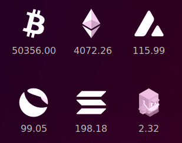

# conky-cryptoWidget
This conky theme displays real-time prices of Bitcoin (BTC), Ethereum (ETH), Avalanche (AVAX), Terra (LUNA), Solana (SOL), TraderJoe (JOE) using the [Coingecko-api](https://www.coingecko.com/en/api/documentation).


## Dependencies
This script require the follwing modules/libraries: 
* Conky module; which can be installed using:
```
sudo apt install conky-all
```

## Installation
1. Dowload the project and extract it to your home folder.
2. Navigate to the folder and run the install script in the terminal using 
```
./install
```

## Tests
This code/script has been tested on ubuntu 21.10

## Screenshot


## Contributing
If you have any improvement's suggestions, please contact me or contribute to the repo.

## Acknowledgments
Icons are made by me. If you want to add other coins, search for svg logos online, then remove unnecessary things and put everything on white!

